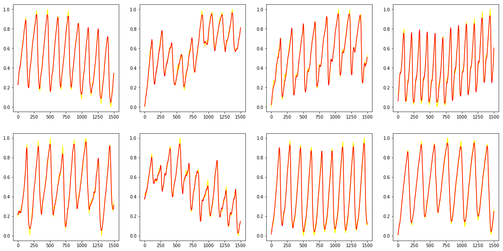
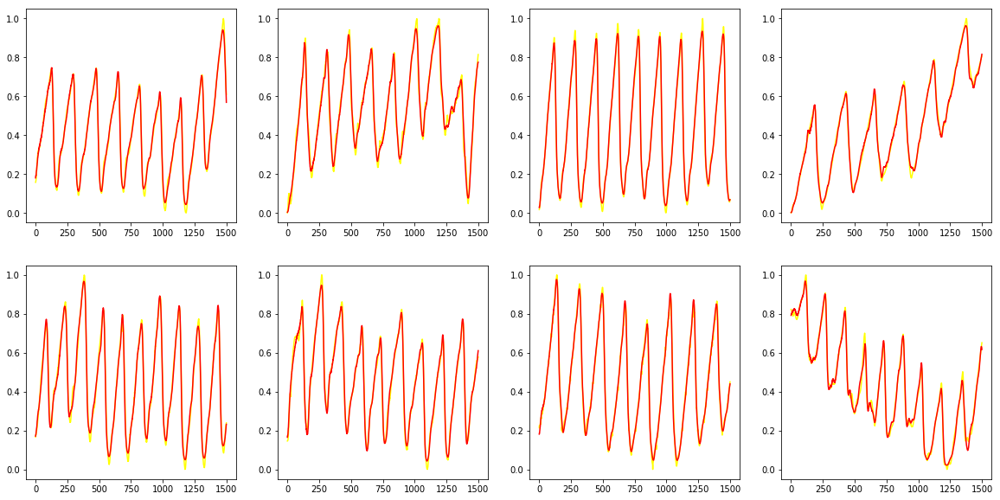
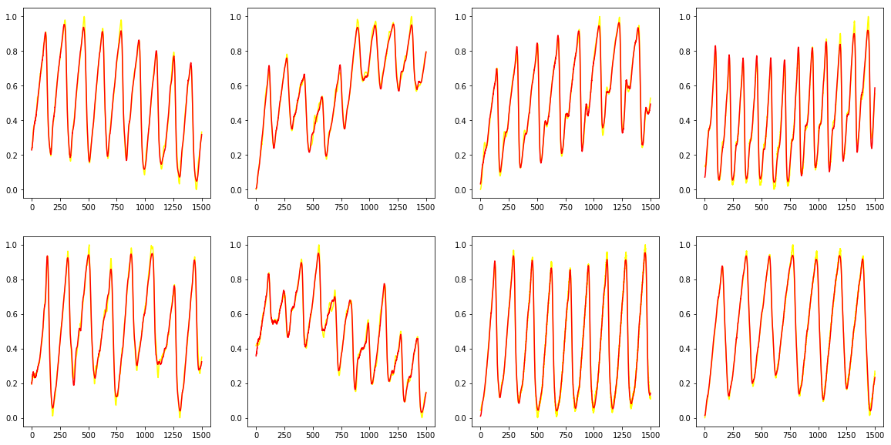
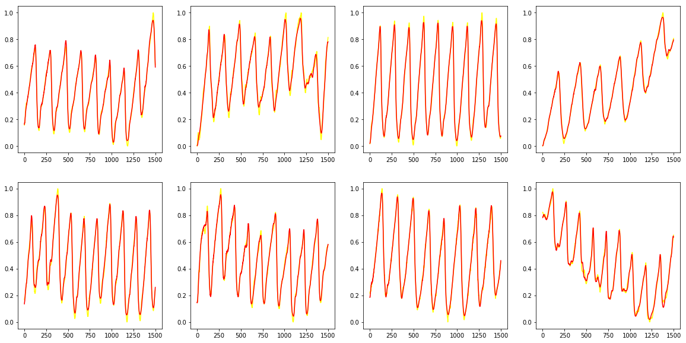
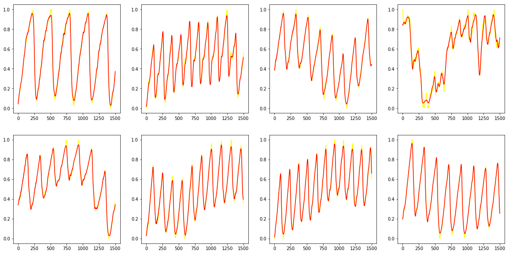
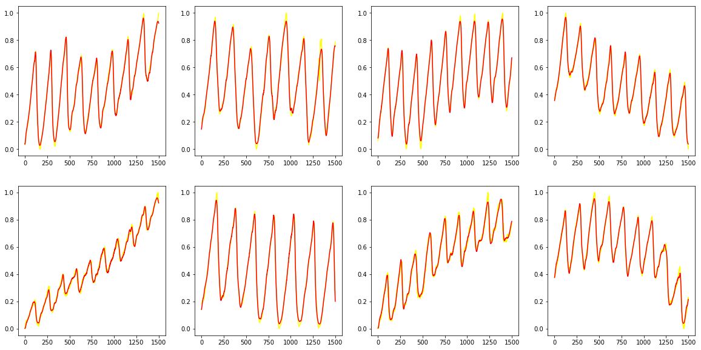

# Table of Contents
## 1.[Preprocess data](#preprocessing)

## 2.[Prelu model](#Prelu)

## 3.[ELu model](#ELu)

## 4.[Customize Loss Function in PyTorch](#Customize)
## 5.[Model in Keras](#Keras)

## Preprocessing


```python
import numpy as np
import pandas as pd
import torch
import torch.nn as nn
import torch.nn.parallel
import torch.optim as optim
import torch.utils.data
from torch.autograd import Variable
import matplotlib.pyplot as plt
import time
import torch.utils.data as Data

data = pd.read_csv('good_data_starts_valley.csv')
from sklearn.preprocessing import MinMaxScaler
sc = MinMaxScaler((0,1))
data_normalized = sc.fit_transform(data.T).T
from sklearn.model_selection import train_test_split
random_state = 11
training_set, test_set = train_test_split(data_normalized, test_size = 0.2, random_state = random_state)
nb_diff = data.shape[1]
nb_train = training_set.shape[0]
nb_test = test_set.shape[0]

training_set = torch.FloatTensor(training_set)
test_set = torch.FloatTensor(test_set)
torch_dataset = Data.TensorDataset(training_set,training_set)

training_set = torch.FloatTensor(training_set)
test_set = torch.FloatTensor(test_set)

BATCH_SIZE = 256
loader = Data.DataLoader(
    dataset = torch_dataset,      # torch TensorDataset format
    batch_size = BATCH_SIZE,      # mini batch size
    shuffle = True,               # random shuffle for training            # subprocesses for loading data
)
```

## Prelu
batch_size = 256

epoch = 10000

learning rate = 0.001

alpha = 0.6

network structure: 1500-200-100-50-100-200-1500

activation function: Prelu

loss function: mse

optimizer: Adam


```python
cd /home/jimmy/Desktop/autoencoder/08032018prelu_alpha
```

    /home/jimmy/Desktop/autoencoder/08032018prelu_alpha


```python
ls
```

    autoencoder_elu_alpha_0.1         autoencoder_pytorch_PReLu_1.py
    autoencoder_elu_alpha_0.4         autoencoder_pytorch_PReLu.py
    autoencoder_elu_alpha_0.6         autoencoder_pytorch_Tanhshrink_0.25.py
    autoencoder_elu_alpha_0.8         autoencoder_pytorch_Tanhshrink.py
    autoencoder_elu_alpha_1           detect_peaks.py
    autoencoder_Prelu_alpha_0.6       good_data_starts_valley.csv
    autoencoder_pytorch_peak_loss.py  numpy.png
    autoencoder_pytorch_PReLu_0.1.py  peak_loss_pytorch.py
    autoencoder_pytorch_PReLu_0.4.py  __pycache__/
    autoencoder_pytorch_PReLu_0.6.py  seed.png
    autoencoder_pytorch_PReLu_0.8.py


```python
EPOCH = 10000
LR = 0.001      # learning rate

ALPHA = 0.6
```


```python
class AutoEncoder(nn.Module):
    def __init__(self):
        super(AutoEncoder, self).__init__()

        self.encoder = nn.Sequential(
            nn.Linear(nb_diff, 200),
            nn.PReLU(init = ALPHA),
            nn.Linear(200, 100),
            nn.PReLU(init = ALPHA),
            nn.Linear(100, 50),
        )
        self.decoder = nn.Sequential(
            nn.Linear(50, 100),
            nn.PReLU(init = ALPHA),
            nn.Linear(100, 200),
            nn.PReLU(init = ALPHA),
            nn.Linear(200, nb_diff),
            nn.Sigmoid(),       # compress to a range (0, 1)
        )

    def forward(self, x):
        encoded = self.encoder(x)
        decoded = self.decoder(encoded)
        return encoded, decoded
```


```python
model = AutoEncoder()
model.load_state_dict(torch.load('autoencoder_Prelu_alpha_0.6'))
model.cuda()
```


    AutoEncoder(
      (encoder): Sequential(
        (0): Linear(in_features=1500, out_features=200, bias=True)
        (1): PReLU(num_parameters=1)
        (2): Linear(in_features=200, out_features=100, bias=True)
        (3): PReLU(num_parameters=1)
        (4): Linear(in_features=100, out_features=50, bias=True)
      )
      (decoder): Sequential(
        (0): Linear(in_features=50, out_features=100, bias=True)
        (1): PReLU(num_parameters=1)
        (2): Linear(in_features=100, out_features=200, bias=True)
        (3): PReLU(num_parameters=1)
        (4): Linear(in_features=200, out_features=1500, bias=True)
        (5): Sigmoid()
      )
    )


## visualize training data


```python
arrange = 240
plt.figure(figsize = (20,10))
plt.title('123')
c_id = 10
for p in range(1,9,1):
    arrange += 1
    c_plot = plt.subplot(arrange)
    c_input = Variable(training_set[c_id]).unsqueeze(0).cuda()
    c_encoded, c_decoded = model(c_input)
    c_decoded = c_decoded.cpu().data.numpy()
    c_plot.plot(training_set[c_id].data.numpy(), color = 'yellow')
    c_plot.plot(c_decoded[0], color = 'red')
    c_id += 1
plt.show()
```





## visualize test data


```python
arrange = 240
plt.figure(figsize = (20,10))
plt.title('123')
c_id = 10
for p in range(1,9,1):
    arrange += 1
    c_plot = plt.subplot(arrange)
    c_input = Variable(test_set[c_id]).unsqueeze(0).cuda()
    c_encoded, c_decoded = model(c_input)
    c_decoded = c_decoded.cpu().data.numpy()
    c_plot.plot(test_set[c_id].data.numpy(), color = 'yellow')
    c_plot.plot(c_decoded[0], color = 'red')
    c_id += 1
plt.show()
```





```python
#calculate all mse on training and test data
from sklearn.metrics import mean_squared_error

training_mse = 0
for c_id in range(len(training_set)):
    c_input = Variable(training_set[c_id]).unsqueeze(0).cuda()
    c_encoded, c_decoded = model(c_input)
    c_decoded = c_decoded.cpu().data.numpy()
    training_mse += mean_squared_error(training_set[c_id].data.numpy(), c_decoded[0])

training_mse = training_mse / len(training_set)


test_mse = 0
for c_id in range(len(test_set)):
    c_input = Variable(test_set[c_id]).unsqueeze(0).cuda()
    c_encoded, c_decoded = model(c_input)
    c_decoded = c_decoded.cpu().data.numpy()
    test_mse += mean_squared_error(test_set[c_id].data.numpy(), c_decoded[0])

test_mse = test_mse / len(test_set)
```


```python
print('training loss:%.6f'%training_mse,'\t','testing loss:%.6f'%test_mse)
```

    training loss:0.000452 	 testing loss:0.000572


## Elu
batch_size = 256

epoch = 10000

learning rate = 0.001

alpha = 0.8

network structure: 1500-200-100-50-100-200-1500

activation function: Elu

loss function: mse

optimizer: Adam


```python
ALPHA = 0.8
```


```python
class AutoEncoder(nn.Module):
    def __init__(self):
        super(AutoEncoder, self).__init__()

        self.encoder = nn.Sequential(
            nn.Linear(nb_diff, 200),
            nn.ELU(alpha = ALPHA),
            nn.Linear(200, 100),
            nn.ELU(alpha = ALPHA),
            nn.Linear(100, 50),
        )
        self.decoder = nn.Sequential(
            nn.Linear(50, 100),
            nn.ELU(alpha = ALPHA),
            nn.Linear(100, 200),
            nn.ELU(alpha = ALPHA),
            nn.Linear(200, nb_diff),
            nn.Sigmoid(),       # compress to a range (0, 1)
        )

    def forward(self, x):
        encoded = self.encoder(x)
        decoded = self.decoder(encoded)
        return encoded, decoded
```


```python
cd /home/jimmy/Desktop/autoencoder/07312018alpha_search
```

    /home/jimmy/Desktop/autoencoder/07312018alpha_search


```python
ls
```

    autoencoder_elu_alpha_0.2        autoencoder_pytorch_elu_a0.8.py
    autoencoder_elu_alpha_0.4        autoencoder_pytorch_elu.py
    autoencoder_elu_alpha_0.6        detect_peaks.py
    autoencoder_elu_alpha_0.8        good_data_starts_valley.csv
    autoencoder_pytorch_elu_a0.2.py  peak_loss_pytorch.py
    autoencoder_pytorch_elu_a0.4.py  __pycache__/
    autoencoder_pytorch_elu_a0.6.py


```python
model = AutoEncoder()
model.load_state_dict(torch.load('autoencoder_elu_alpha_0.8'))
model.cuda()
```


    AutoEncoder(
      (encoder): Sequential(
        (0): Linear(in_features=1500, out_features=200, bias=True)
        (1): ELU(alpha=0.8)
        (2): Linear(in_features=200, out_features=100, bias=True)
        (3): ELU(alpha=0.8)
        (4): Linear(in_features=100, out_features=50, bias=True)
      )
      (decoder): Sequential(
        (0): Linear(in_features=50, out_features=100, bias=True)
        (1): ELU(alpha=0.8)
        (2): Linear(in_features=100, out_features=200, bias=True)
        (3): ELU(alpha=0.8)
        (4): Linear(in_features=200, out_features=1500, bias=True)
        (5): Sigmoid()
      )
    )


## visualize training data


```python
arrange = 240
plt.figure(figsize = (20,10))
plt.title('123')
c_id = 10
for p in range(1,9,1):
    arrange += 1
    c_plot = plt.subplot(arrange)
    c_input = Variable(training_set[c_id]).unsqueeze(0).cuda()
    c_encoded, c_decoded = model(c_input)
    c_decoded = c_decoded.cpu().data.numpy()
    c_plot.plot(training_set[c_id].data.numpy(), color = 'yellow')
    c_plot.plot(c_decoded[0], color = 'red')
    c_id += 1
plt.show()
```





## visualize test data


```python
arrange = 240
plt.figure(figsize = (20,10))
plt.title('123')
c_id = 10
for p in range(1,9,1):
    arrange += 1
    c_plot = plt.subplot(arrange)
    c_input = Variable(test_set[c_id]).unsqueeze(0).cuda()
    c_encoded, c_decoded = model(c_input)
    c_decoded = c_decoded.cpu().data.numpy()
    c_plot.plot(test_set[c_id].data.numpy(), color = 'yellow')
    c_plot.plot(c_decoded[0], color = 'red')
    c_id += 1
plt.show()
```





```python
training_mse = 0
for c_id in range(len(training_set)):
    c_input = Variable(training_set[c_id]).unsqueeze(0).cuda()
    c_encoded, c_decoded = model(c_input)
    c_decoded = c_decoded.cpu().data.numpy()
    training_mse += mean_squared_error(training_set[c_id].data.numpy(), c_decoded[0])

training_mse = training_mse / len(training_set)


test_mse = 0
for c_id in range(len(test_set)):
    c_input = Variable(test_set[c_id]).unsqueeze(0).cuda()
    c_encoded, c_decoded = model(c_input)
    c_decoded = c_decoded.cpu().data.numpy()
    test_mse += mean_squared_error(test_set[c_id].data.numpy(), c_decoded[0])

test_mse = test_mse / len(test_set)
print('training loss:%.6f'%training_mse,'\t','testing loss:%.6f'%test_mse)
```

    training loss:0.000454 	 testing loss:0.000568


## Customize 
## Loss Function

## Add peak & valley loss to loss function

class MyLoss(nn.Module):

    def __init__(self):
    
        super(MyLoss, self).__init__()
        
    def forward(self, yp, yt):
    
        yt_cpu = yt.cpu().data.numpy()
        
        total_loss = 0
        
        for i in range(len(yt_cpu)):
        
            cur_y =yt_cpu[i]
            
            peak = detect_peaks.detect_peaks(cur_y, mpd=150, show = False)
            
            valley = detect_peaks.detect_peaks(cur_y, valley = True, mpd=150, show = False)
            
            total_loss += ((yt[i][peak] - yp[i][peak]) **2).sum() + ((yt[i][valley] - yp[i][valley]) **2).sum()
            
        total_loss = total_loss / len(yt_cpu)
        
        return total_loss
        
loss_func2 = nn.MSELoss()

loss_func = MyLoss()

lossweight = 0.5

for epoch in range(EPOCH):

    for ...:
    
        ...
        
        loss = lossweight * loss_func(decoded, b_y_cuda) + (1 - lossweight) * loss_func2(decoded, b_y_cuda)
        
        ...
        

## Keras


```python
cd /home/jimmy/Desktop/autoencoder/07272018activation_function
```

    /home/jimmy/Desktop/autoencoder/07272018activation_function


## Load elu model
batch_size = 256

epoch = 10000

learning rate = 0.001

alpha = 1.0(defualt)

network structure: 1500-200-100-50-100-200-1500

activation function: Elu

loss function: mse

optimizer: Adam


```python
from keras.models import load_model
from keras.models import Model
from keras.layers import Dense, Input
from keras import optimizers
import matplotlib.pyplot as plt
import pandas as pd
import tensorflow as tf
import peak_loss

model_elu = load_model('auto_keras_elu.h5')

from sklearn.model_selection import train_test_split
random_state = 11
training_set, test_set = train_test_split(data, test_size = 0.2, random_state = random_state)
from sklearn.preprocessing import MinMaxScaler
sc = MinMaxScaler((0,1))
training_set = sc.fit_transform(training_set.T).T

sc2 = MinMaxScaler((0,1))
test_set = sc2.fit_transform(test_set.T).T
```

    Using TensorFlow backend.


## visualizer training data


```python
arrange = 240
plt.figure(figsize = (20,10))
plt.title('123')
c_id = 0
for p in range(1,9,1):
    arrange += 1
    c_plot = plt.subplot(arrange)
    c_input = training_set[c_id].reshape(1,-1)
    c_encoded = model_elu.predict(c_input)
    c_plot.plot(c_input[0], color = 'yellow')
    c_plot.plot(c_encoded[0], color = 'red')
    c_id += 1
plt.show()
```





## visualize test data


```python
arrange = 240
plt.figure(figsize = (20,10))
plt.title('123')
c_id = 0
for p in range(1,9,1):
    arrange += 1
    c_plot = plt.subplot(arrange)
    c_input = test_set[c_id].reshape(1,-1)
    c_encoded = model_elu.predict(c_input)
    c_plot.plot(c_input[0], color = 'yellow')
    c_plot.plot(c_encoded[0], color = 'red')
    c_id += 1
plt.show()
```





```python
from sklearn.metrics import mean_squared_error
predicted_train = model_elu.predict(training_set)
training_mse = mean_squared_error(training_set, predicted_train)
predicted_test = model_elu.predict(test_set)
test_mse = mean_squared_error(test_set, predicted_test)
```


```python
print('training loss:%.6f'%training_mse,'\t','testing loss:%.6f'%test_mse)
```

    training loss:0.000449 	 testing loss:0.000569

